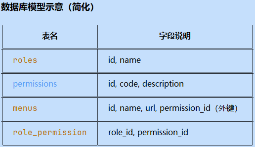
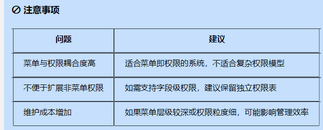

参数校验    1

全局异常处理 1

登录功能，（解决跨域问题）  服务添加跨域配置

角色鉴权（自定义鉴权注解）  后续添加

实现用户相关接口、（注册、登录、退出登录、修改密码、用户信息【去除密码】)

角色接口 1

权限接口 1

角色权限关联表接口（角色id、权限id）

用户角色关联表接口（用户id、角色id）  新增用户角色关联、新增用户角色关联、查询用户角色关联
方案一，四张表

方案二，三张表，将权限和菜单表合并。适用于菜单即权限

对权限表进行扩字段，加上菜单信息，实现角色与菜单的关联。同时添加菜单的组件信息。从而实现vue的动态路由功能

blog相关接口

标签（新增、删除【真实】、查询List<Map>、查询分页）

分类（新增、删除【真实】、查询List<Map>、查询分页）

文章标题(新增、修改、查询分页)

文章内容（新增、修改、查询）

文章新增业务层：标签、分类、文章标题、文章内容等服务组装使用